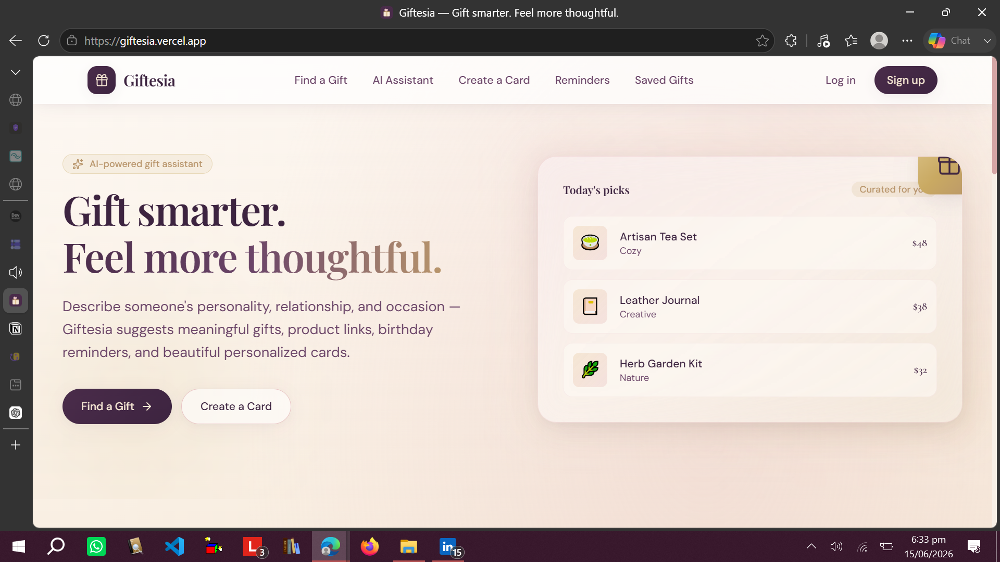
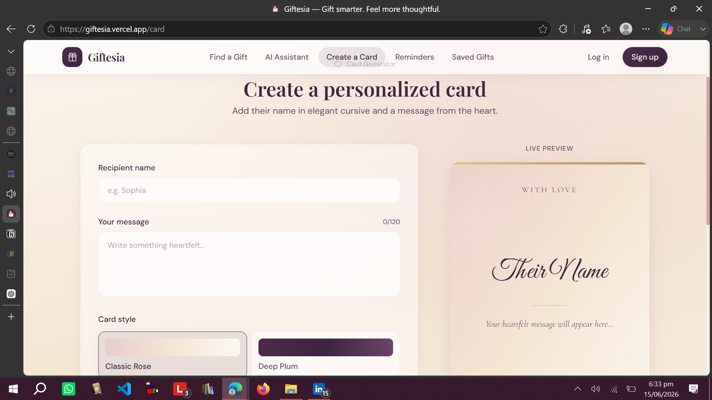

# Giftesia 🎁

An AI-powered gift recommendation platform that helps users find personalized gift ideas and generate custom greeting cards for special occasions.

**Live:** https://giftesia.vercel.app

---

## 📌 Overview

Giftesia uses intelligent suggestions to help users choose meaningful gifts based on preferences, occasions, and relationships.
It is designed to make gift selection simple, fast, and personalized using AI-assisted logic.

---

## 🚧 Project Status

⚠️ This project is still **under development**.

* Backend integration is not fully connected yet
* Some features are currently frontend-only
* API integration and full system wiring is planned in next phase

---

## 🚀 Features

* AI-based gift recommendations
* Occasion-based filtering (birthday, anniversary, etc.)
* Personalized suggestions based on user input
* Custom greeting card generation (UI ready)
* Clean and responsive interface

---

## 🛠️ Tech Stack

* JavaScript
* React (frontend)
* AI Integration (planned / partial)
* Vercel Deployment

---

## 📸 Screenshots

### 🏠 Home Page

### 🎁 Card creation View

---

## ⚙️ Purpose

This project demonstrates early-stage product development with AI-assisted features, currently evolving toward full backend integration and production-ready architecture.
